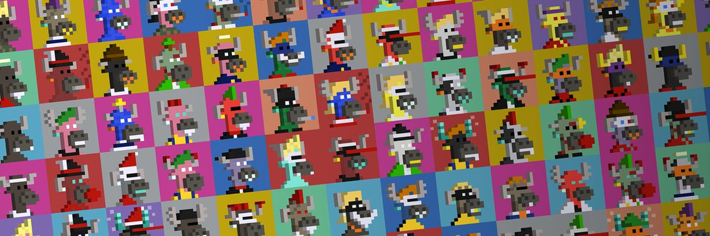

# BlockyBulls - The PFP Based & Bullish

BlockyBulls is a NFT ecosystem featuring multiple collections and interactive tools on the Base blockchain.
This repository contains the main web application for interacting with BlockyBulls NFTs and related projects.



## 🎯 Project Overview

BlockyBulls consists of:
- **BlockyBulls**: A collection of 5,500 unique pixelated bull PFPs in a classic 16x16 format
- **BasedSnout**: Unique Snout NFTs based on Ethereum addresses
- **BeyondTheBlock**: Special edition NFTs extending the BlockyBulls universe
- **Honorary**: Exclusive NFTs representing people with bullish vibes

### Key Features

- **NFT Explorer**: Browse and filter NFTs across all collections
- **Marketplace Integration**: Buy and sell NFTs with integrated marketplace
- **Interactive Tools**: 
  - BlockyBulls Builder (create custom BlockyBulls)
  - Reveal The Bull (interactive reveal experience)
  - BasedSnout Generator (mint unique address-based NFTs)
  - Community Polls (vote on proposals)
- **Collection Statistics**: Track rarity, attributes, and market data

## 🚀 Quick Start

### Prerequisites

- Node.js (v14.0.0 or later)
- npm or yarn
- A Web3 wallet (MetaMask, Coinbase Wallet)

### Installation

1. Clone the repository:
```bash
git clone https://github.com/blockybulls/blockybulls-frontend.git
cd blockybulls-frontend
```

2. Install dependencies:
```bash
npm install
# or
yarn install
```

3. Create a `.env` file with your Thirdweb client ID:
```env
VITE_THIRDWEB_CLIENT_ID=your_client_id_here
```

4. Start the development server:
```bash
npm run dev
# or
yarn dev
```

5. Open [http://localhost:5173](http://localhost:5173) in your browser.

## 🏗️ Project Structure

```
blockybulls/
├── src/
│   ├── pages/                 # Page components
│   │   ├── home/              # Homepage
│   │   ├── collections/       # Collection browsing
│   │   ├── nft/               # NFT details
│   │   └── bbverse/           # Interactive tools
│   ├── components/            # Reusable components
│   │   ├── common/            # Shared UI components
│   │   ├── ui/                # Base UI components
│   │   ├── nft/               # NFT-specific components
│   │   └── marketplace/       # Marketplace components
│   ├── lib/                   # Utility functions
│   ├── hooks/                 # Custom React hooks
│   ├── contexts/              # React contexts
│   ├── consts/                # Constants and contracts
│   └── styles/                # Global styles
└── public/                    # Static assets
```

## 🔧 Tech Stack

- **Frontend**: React, TypeScript, Tailwind CSS, DaisyUI
- **Blockchain Integration**: Thirdweb v5
- **Web3 Libraries**: ethers.js

## 🎨 BBverse Features in Detail

### BlockyBulls Builder
Create custom BlockyBulls by combining attributes from the existing collection. Features real-time preview and attribute selection interface.

### BasedSnout
- Generate unique NFT art based on Ethereum addresses
- Tiered pricing system (whitelist, BlockyBull holders, public)
- Progressive minting with increasing prices

### Reveal The Bull
Interactive experience inspired by koalastothemax.com that gradually reveals BlockyBulls NFTs.

### NFT Explorer & Marketplace
- Filter NFTs by attributes
- View rarity rankings
- Integrated buying/selling functionality
- Support for multiple collections

### Governance Polls
- Create and vote on proposals
- Token-gated participation
- Comment system for community discussion

## 🔐 Smart Contracts

The project interacts with multiple smart contracts on the Base blockchain:

- **BlockyBulls**: `0xd9D98A369BBAA3934304D6ACBf9013E33e2a3368`
- **BasedSnout**: `0xa4F353a0E294Ec6deB943DBD7F56a5c315B6f65b`
- **BeyondTheBlock**: `0x50344910D047dAa13A164c991aeBe39aBA170ca5`
- **Honorary**: `0xd3aff8a8f31ce60c9e1b5221a22503ebba7f1688`
- **Marketplace**: `0xdf93B6F633d1E4F956FBCf94ed56165B5c773Bf1`
- **Polls**: `0x31d7b64631e6B225a703E5a5457f0FB29aE365eE`

## 📦 Building & Deployment

### Production Build

```bash
npm run build
# or
yarn build
```

## 🛠️ Development

### Key Commands

- `npm run dev` - Start development server
- `npm run build` - Build for production
- `npm run preview` - Preview production build
- `npm run format` - Format code with Prettier

### Environment Variables

```env
VITE_THIRDWEB_CLIENT_ID=your_client_id
```

## 📚 Documentation

- [Thirdweb Documentation](https://portal.thirdweb.com/)
- [Project Articles](https://mirror.xyz/blockybulls.eth)
- [Discord Community](https://discord.gg/4VZNyVEgsr)

## 🌐 Links

- [Website](https://blockybulls.com)
- [OpenSea](https://opensea.io/collection/blockybulls)
- [X (Twitter)](https://x.com/BlockyBulls)
- [Discord](https://discord.gg/4VZNyVEgsr)

## 📞 Contact

For any questions or support, join our [Discord](https://discord.gg/4VZNyVEgsr) community or reach out on [X](https://x.com/BlockyBulls).

---

**Stay Bullish Always!** 🐂